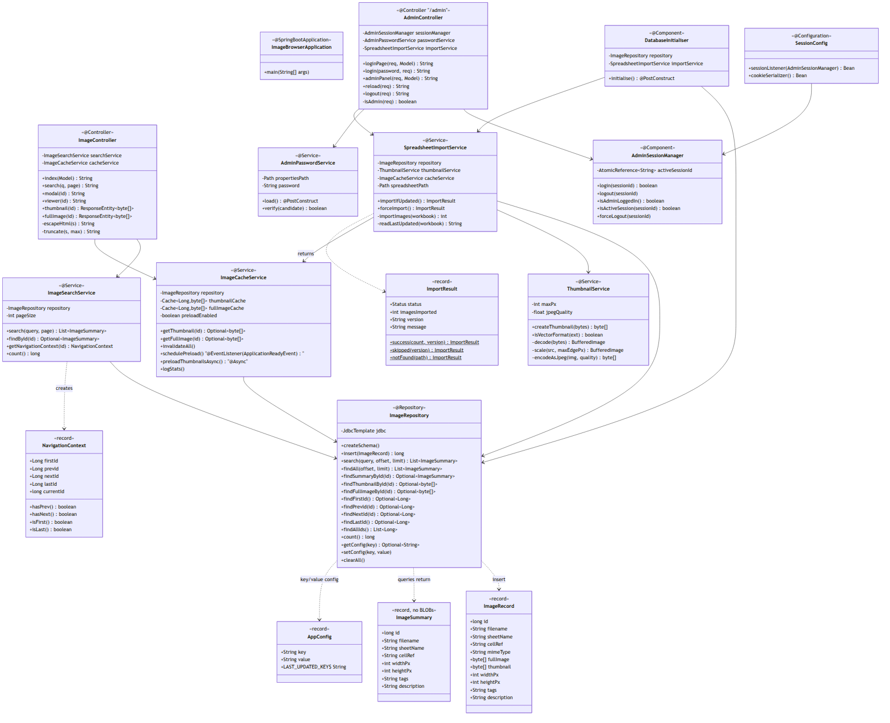
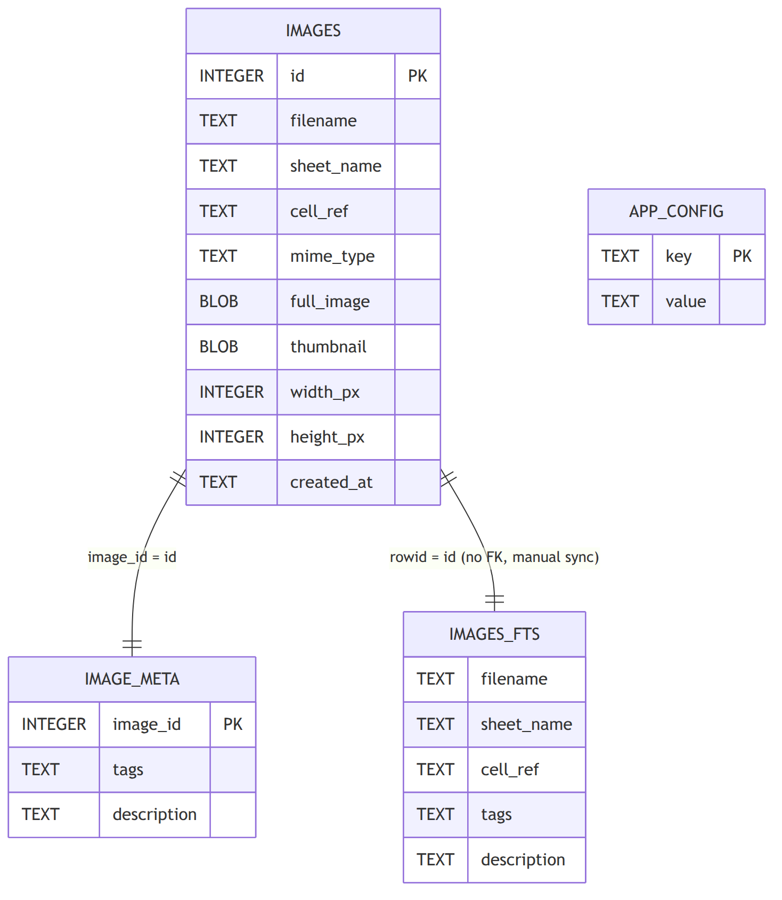
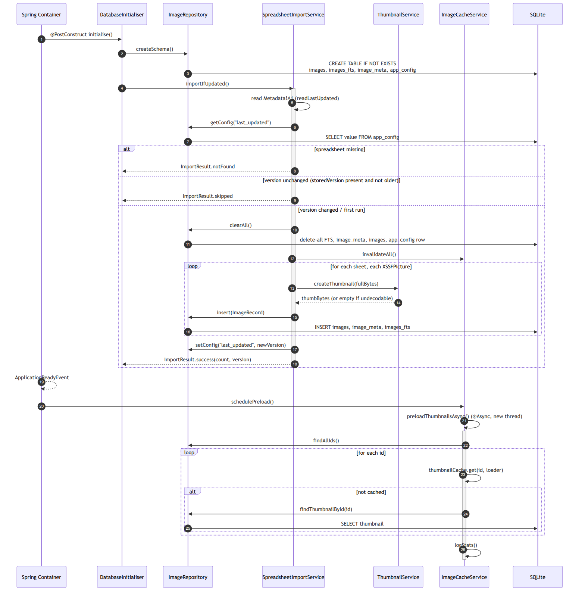
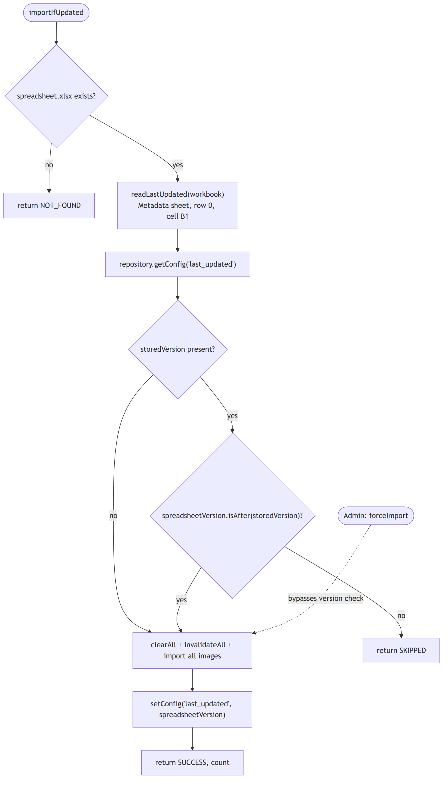
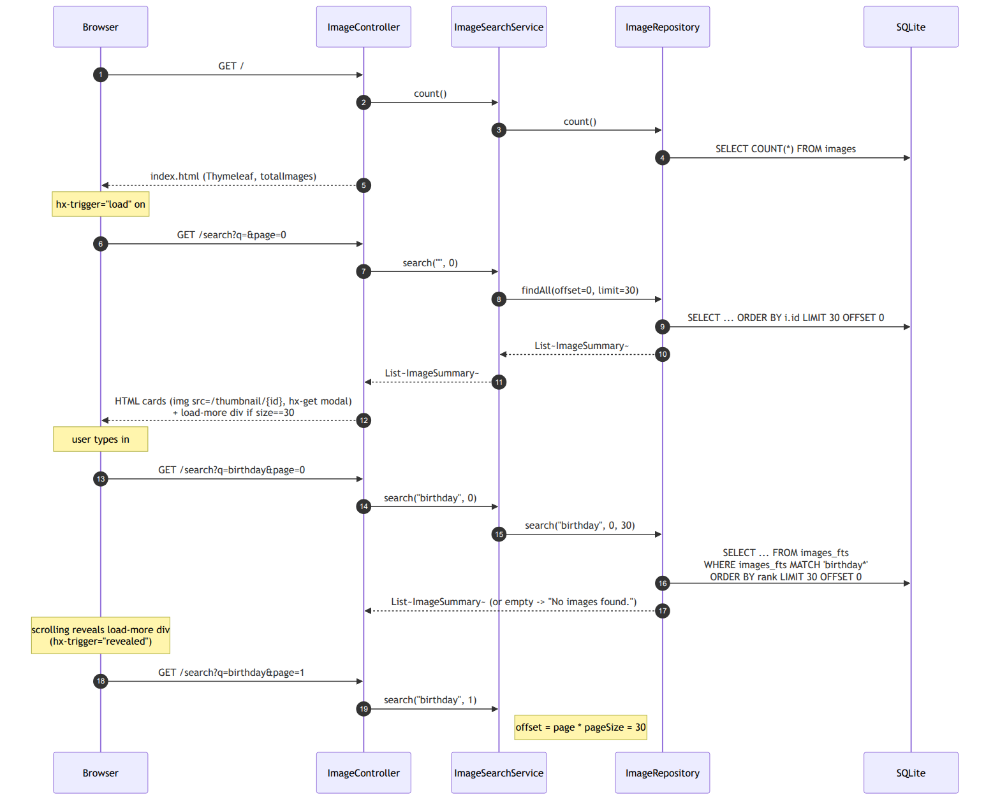
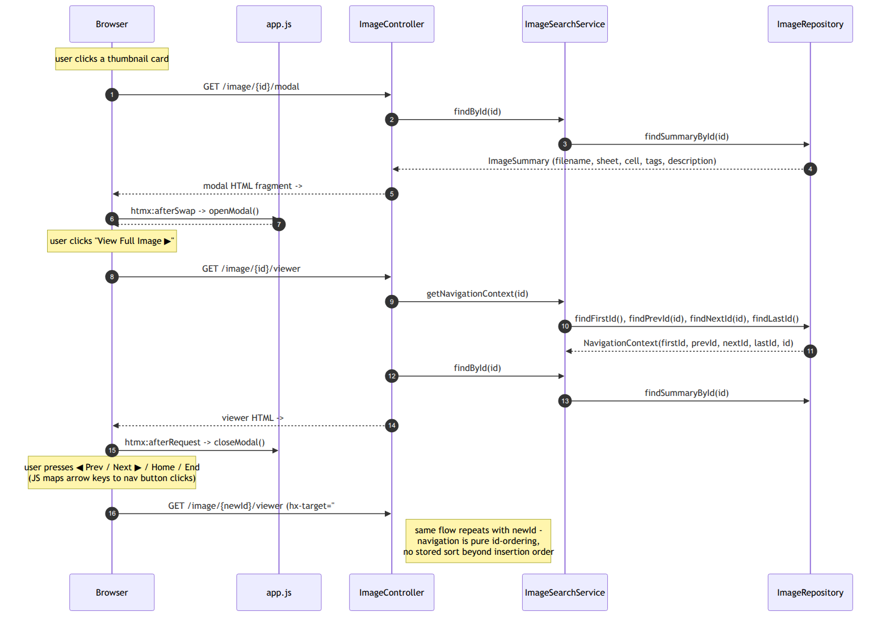
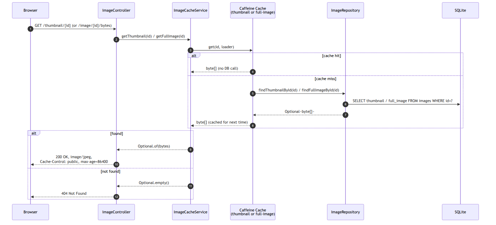
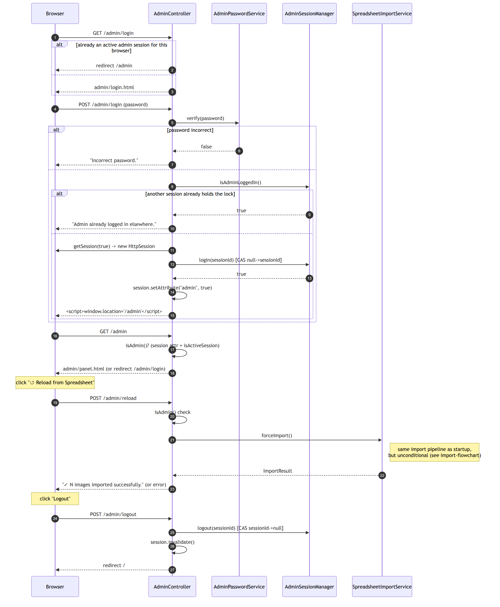

# Architecture & Flow Reference

This document complements `README.md` (deployment/ops) and `CLAUDE.md` (AI-agent
guidance) with diagrams of how the application is structured and how it behaves
at runtime, end to end.

> Diagram sources are Mermaid (`.mmd`) files in [`docs/diagrams/`](diagrams/),
> rendered to PNG for easy viewing. To regenerate after editing a `.mmd` file,
> create a puppeteer config (needed in sandboxed environments):
> ```bash
> echo '{"args":["--no-sandbox","--disable-setuid-sandbox"]}' > /tmp/puppeteer-config.json
> npx -p @mermaid-js/mermaid-cli mmdc -p /tmp/puppeteer-config.json \
>   -i docs/diagrams/NAME.mmd -o docs/diagrams/NAME.png -b white -s 2
> ```

Contents:

1. [Class diagram](#1-class-diagram)
2. [Data model (SQLite)](#2-data-model-sqlite)
3. [Startup sequence](#3-startup-sequence)
4. [Spreadsheet import — version gating](#4-spreadsheet-import--version-gating)
5. [Browse & search flow](#5-browse--search-flow)
6. [Image viewer & navigation flow](#6-image-viewer--navigation-flow)
7. [Binary image serving (cache)](#7-binary-image-serving-cache)
8. [Admin login / reload / logout flow](#8-admin-login--reload--logout-flow)

---

## 1. Class diagram

Only fields/methods relevant to collaboration are shown. All beans are
singletons wired by Spring's constructor injection.



---

## 2. Data model (SQLite)

Schema is created by `ImageRepository.createSchema()` (idempotent
`CREATE TABLE IF NOT EXISTS`). There are **no ORM/FTS sync triggers** — the
repository writes to all three image-related tables explicitly inside
`insert()` and `clearAll()`.



`images_fts` is an FTS5 **external-content** table (`content='images'`,
`content_rowid='id'`). Because there's no trigger sync, every insert/clear
must touch `images`, `image_meta`, and `images_fts` together — see
`ImageRepository.insert()` and `ImageRepository.clearAll()`.

`app_config` currently holds a single row: `last_updated`, the version stamp
copied from the spreadsheet's `Metadata!A1` cell.

---

## 3. Startup sequence

Three things happen in order, driven by Spring lifecycle hooks:

1. `DatabaseInitialiser.initialise()` — `@PostConstruct`, synchronous, blocks
   readiness.
2. `SpreadsheetImportService.importIfUpdated()` — called from step 1.
3. `ImageCacheService.schedulePreload()` — fires on `ApplicationReadyEvent`
   (i.e. **after** step 1/2 complete and the schema/data exist), then runs the
   actual preload `@Async` on a separate thread.



Notes:

- `AdminPasswordService.load()` (also `@PostConstruct`) runs independently — it calls
  `repository.createSchema()` itself (idempotent) to avoid relying on init order, then reads
  the BCrypt hash from `app_config` (`admin_password_hash`), seeding a hash of the default
  password `BoSPhotoViewer` on first run.
- If the spreadsheet import throws, `DatabaseInitialiser` logs the error but
  does **not** fail startup — the app still serves whatever is already in
  `images.db`.

---

## 4. Spreadsheet import — version gating



- Both versions are parsed as `LocalDateTime` (ISO format, e.g.
  `2026-05-22T10:30:00`), so the timestamp in `Metadata!A1` must be
  parseable as such.
- `forceImport()` (used by the admin "Reload" button) skips the comparison
  entirely and always re-imports.
- `importImages()` skips vector formats (`emf`, `wmf`, `svg` via
  `ThumbnailService.isVectorFormat`) and any image `ImageIO` can't decode
  (empty thumbnail → logged + skipped).

---

## 5. Browse & search flow

The home page (`index.html`) is a Thymeleaf shell; the image grid and all
subsequent interaction are HTMX fragments returned as raw HTML strings from
`ImageController`.



Key details:

- A blank query (`q=`) falls back to `findAll`, ordered by `id` (insertion
  order) — there's no FTS rank to use.
- A non-blank query appends `*` to the trimmed token string for FTS5 prefix
  matching, ordered by `rank`.
- Pagination is purely offset-based (`page * pageSize`); "infinite scroll"
  continues only while a page returns exactly `pageSize` (30) results.
- All user-supplied/data-derived strings (`filename`, `sheetName`, `tags`,
  `description`, `q`) are passed through `escapeHtml()` before being embedded
  in the returned HTML — the only XSS guard in the fragment-building code.

---

## 6. Image viewer & navigation flow



`NavigationContext` flags:

| Flag | Meaning | Drives |
|---|---|---|
| `isFirst()` | `firstId == currentId` | disables "⏮ First" |
| `hasPrev()` | `prevId != null` | disables "◀ Prev" if false |
| `hasNext()` | `nextId != null` | disables "Next ▶" if false |
| `isLast()` | `lastId == currentId` | disables "Last ⏭" |

---

## 7. Binary image serving (cache)

`/thumbnail/{id}` and `/image/{id}/bytes` are the **only** routes that touch
BLOB columns. Both go through `ImageCacheService`'s two independent Caffeine
caches (separate byte-weight budgets, `expireAfterAccess` TTL,
`softValues()`).



`SpreadsheetImportService.importIfUpdated()` / `forceImport()` call
`cacheService.invalidateAll()` before reimporting, so stale BLOBs are never
served after a reload.

---

## 8. Admin login / reload / logout flow

Admin access is gated by **two** checks (`AdminController.isAdmin()`):
the `admin` boolean session attribute **and**
`AdminSessionManager.isActiveSession(sessionId)` — a single global
`AtomicReference<String>` that allows only one admin session at a time.



Session expiry safety net: `SessionConfig` registers an
`HttpSessionListener` that sets `maxInactiveInterval = 30 minutes` on
creation and calls `AdminSessionManager.forceLogout(sessionId)` on
`sessionDestroyed` — so a closed browser tab eventually releases the admin
lock without an explicit logout.
